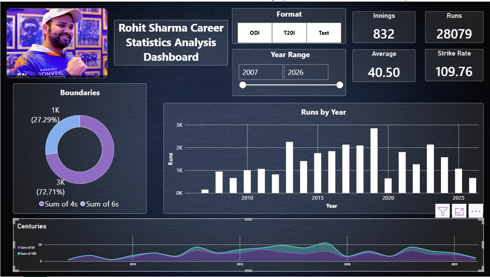

# 🏏 Rohit Sharma Career Analysis — Power BI

An interactive Power BI dashboard developed to analyze Rohit Sharma's
international cricket career across ODI, T20I, and Test formats.

The project transforms cricket performance data into an interactive
dashboard using Power BI, DAX, Power Query, and Excel.

---

## 📊 Dashboard Preview



---

## 🎯 Project Objective

The objective of this project is to analyze Rohit Sharma's career
performance and identify trends across different cricket formats and
years.

The dashboard provides an interactive way to explore batting
performance using key statistical metrics and visualizations.

---

## 📌 Dashboard Features

### Career Performance KPIs

- 🏏 Total Runs
- 📊 Innings
- 📈 Batting Average
- ⚡ Strike Rate
- 4️⃣ Fours
- 6️⃣ Sixes

### Interactive Analysis

- Format-wise analysis:
  - ODI
  - T20I
  - Test
- Year-range filtering
- Year-wise run analysis
- 50s and 100s analysis
- Boundary analysis
- Interactive Power BI filters and slicers

---

## 📈 Key Visualizations

The dashboard includes:

- **Runs by Year** — Tracks changes in run-scoring performance over time.
- **Fours & Sixes** — Analyzes boundary contribution.
- **50s & 100s by Year** — Shows batting milestones throughout the career.
- **KPI Cards** — Provides an overview of selected career statistics.
- **Format Selector** — Allows comparison between ODI, T20I, and Test
  performances.

---

## 🛠️ Tools & Technologies

| Tool | Purpose |
|---|---|
| **Power BI** | Dashboard development and visualization |
| **DAX** | Calculated measures and analytical metrics |
| **Power Query** | Data transformation and preparation |
| **Microsoft Excel** | Dataset preparation and organization |

---

## 🔄 Project Workflow

```text
Raw Cricket Data
       ↓
Data Collection
       ↓
Excel Data Preparation
       ↓
Power Query
       ↓
Data Transformation
       ↓
DAX Measures
       ↓
Power BI Visualizations
       ↓
Interactive Dashboard
